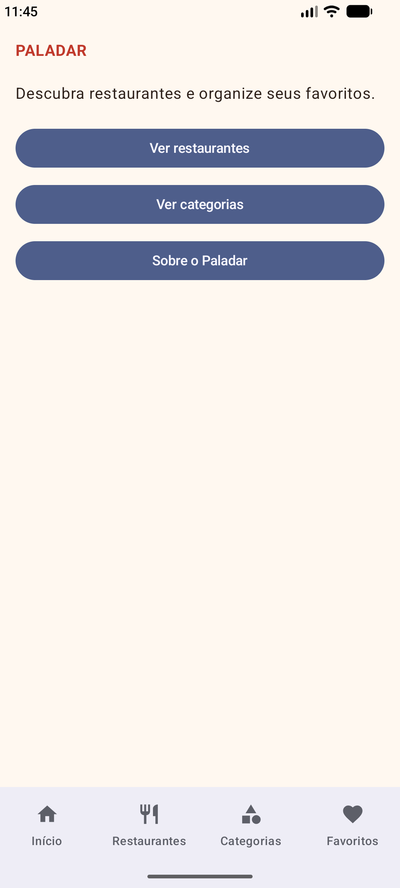
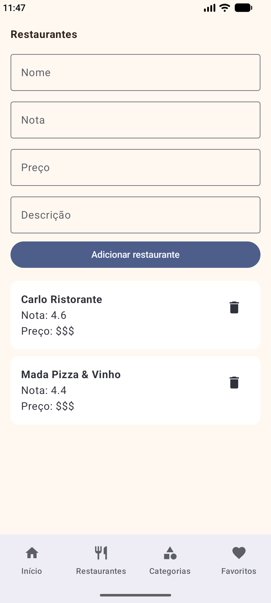
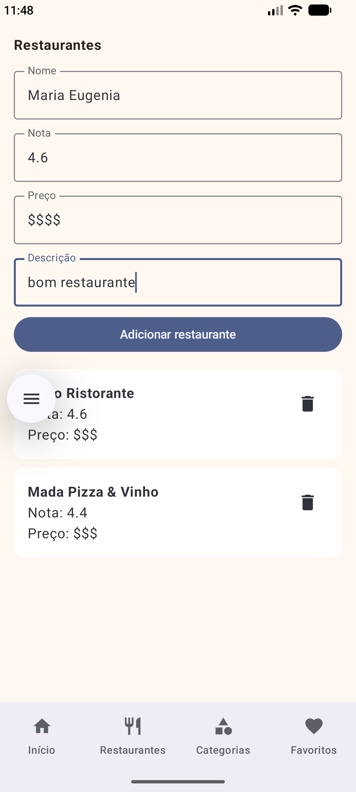
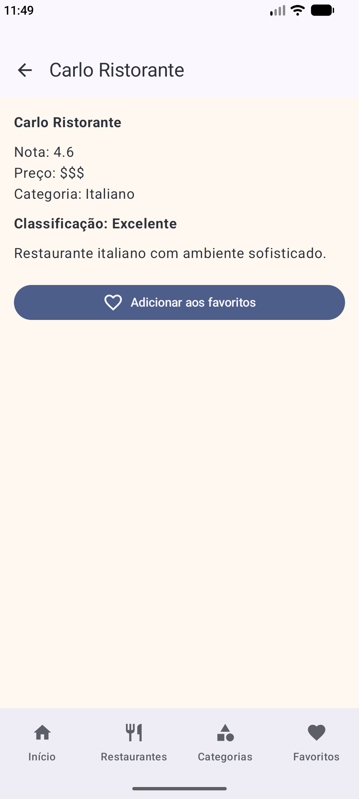
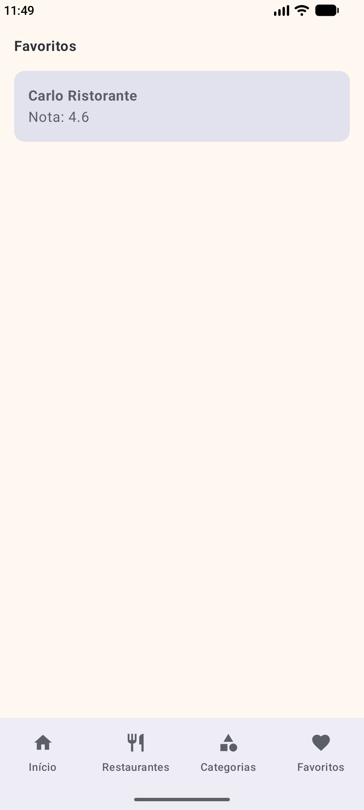

# Processo do projeto Paladar

## 1. Como estava o projeto no Trabalho 1 e o que mudou

Eu não fiz o projeto do Trabalho 1, então comecei este projeto praticamente do zero para este trabalho.

A ideia do Paladar é ser um aplicativo para organizar e visualizar restaurantes.

Durante o desenvolvimento, foram adicionadas as telas do aplicativo, a navegação entre elas, as listas de restaurantes e categorias, os formulários para adicionar itens, a opção de remover itens, as telas de detalhes e a parte de favoritos.

Também organizei o código em arquivos diferentes para facilitar a navegação e deixar cada parte do projeto mais organizada.

## 2. Por que escolhi essas telas

A principal ideia do aplicativo é trabalhar com restaurantes, então uma das telas principais é a lista de restaurantes.

Nessa tela é possível adicionar um restaurante, remover um restaurante e clicar nele para abrir seus detalhes.

Também foi criada a lista de categorias. Ela funciona de forma parecida, permitindo adicionar e remover categorias e abrir os detalhes de cada uma.

As telas de detalhes foram feitas para mostrar as informações do item selecionado. Também foi criada a tela de favoritos para mostrar os restaurantes que foram marcados como favoritos.

Além dessas telas, o aplicativo possui a tela inicial e uma tela Sobre.

As telas foram separadas dessa forma para deixar as principais funções do aplicativo mais fáceis de encontrar.

## 3. Como organizei o código

Tentei separar algumas partes do projeto em arquivos diferentes para não deixar todo o código junto.

No `Models.kt` ficam as duas `data class` usadas no projeto:

- `Restaurante`
- `Categoria`

No `Data.kt` ficam os dados iniciais e as listas usando `mutableStateListOf`.

No `Rotas.kt` ficam as rotas utilizadas no aplicativo.

No `AppNavigation.kt` fica a navegação principal, usando `NavHost` e `NavController`.

As telas ficam no `Telas.kt`.

Também usei IDs para conseguir abrir o item correto na tela de detalhes. Quando o usuário clica em um restaurante ou categoria, o ID é passado pela rota e a tela de detalhes procura o item correspondente na lista.

## 4. O que foi colocado a mais na tela de detalhes

A tela de detalhes do restaurante não mostra somente os dados que foram cadastrados.

Ela também mostra a categoria do restaurante e calcula uma classificação de acordo com a nota.

A classificação ficou assim:

- 4,5 ou mais: Excelente
- 4,0 ou mais: Muito bom
- 3,0 ou mais: Bom
- Abaixo de 3,0: Pode melhorar

Também é possível marcar o restaurante como favorito.

Escolhi fazer isso porque a tela de detalhes passa a utilizar os dados do restaurante para gerar outras informações, além de relacionar o restaurante com uma categoria.

## 5. Dificuldades encontradas

Uma das partes que mais deu trabalho foi fazer a navegação entre todas as telas funcionar corretamente.

Também tive dificuldade para fazer a tela de detalhes abrir o item certo. Para resolver isso, usei o ID do item na rota e depois procurei esse ID na lista.

Outra parte foi fazer as listas permitirem adicionar e remover itens e atualizar a tela corretamente.

Durante os testes também tive alguns problemas com o Android Studio e com o emulador. Em uma das tentativas o emulador ficou preso em um processo e não conseguia iniciar novamente. Depois de recriar o dispositivo virtual, o aplicativo voltou a funcionar normalmente.

## 6. Prints do aplicativo

Os prints abaixo mostram algumas das principais funcionalidades do aplicativo funcionando.

### Tela inicial

### Lista de restaurantes

### Adicionando um restaurante

### Detalhes do restaurante

### Favoritos

### Adicionando uma categoria

